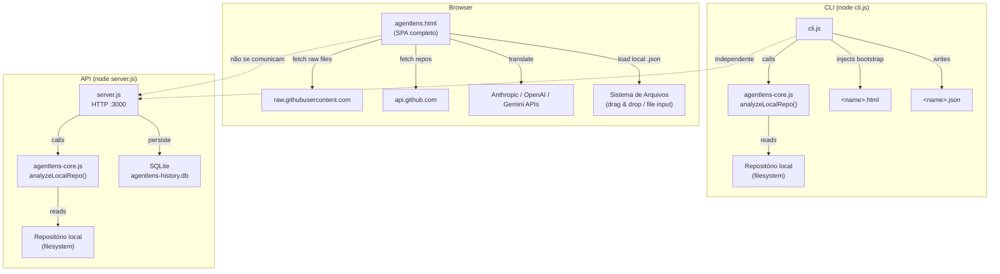
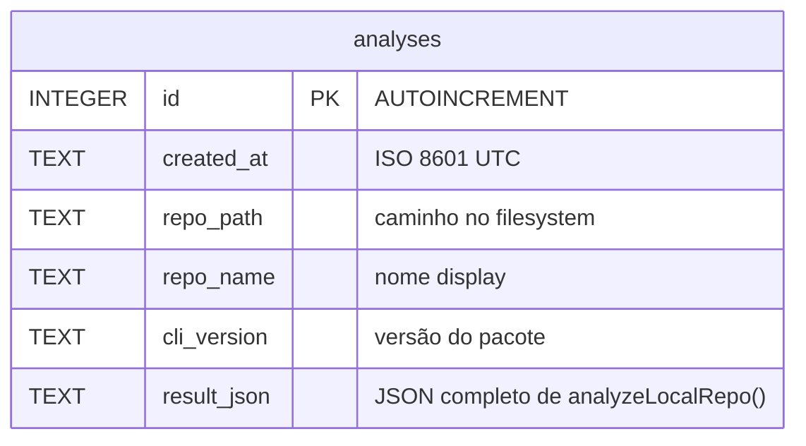
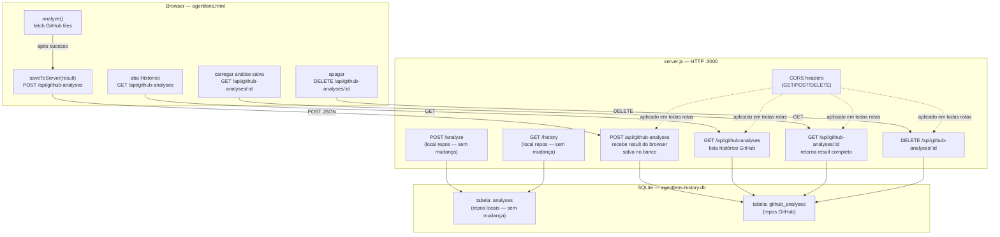
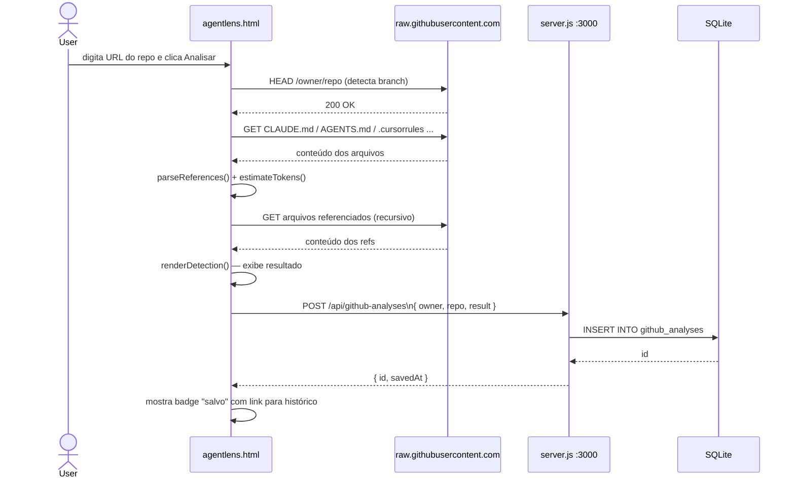
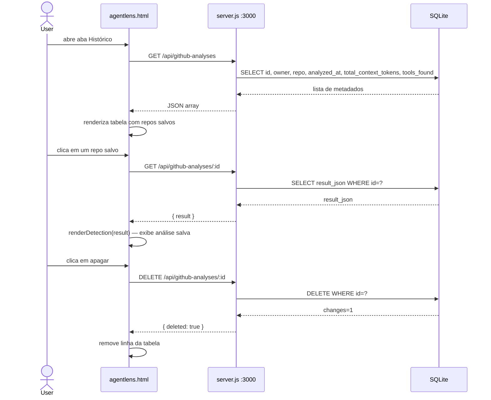
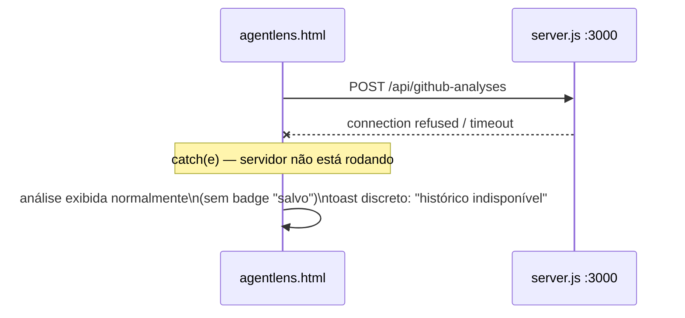
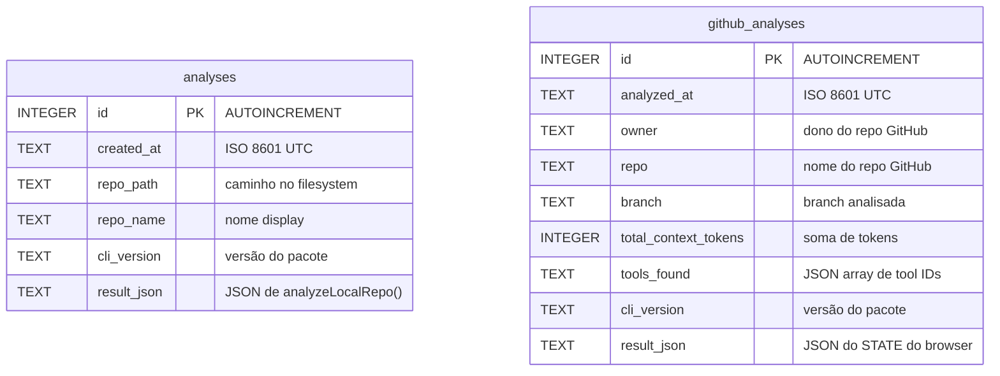

# AgentLens — Integração Frontend ↔ API

## Contexto

Hoje o `agentlens.html` é um SPA 100% client-side: ele busca arquivos de config de agentes direto do GitHub via `raw.githubusercontent.com`, calcula tokens e custos no browser, e não persiste nada. O `server.js` existe como API separada que analisa **repositórios locais** e salva no SQLite — mas o frontend nunca o usa.

O objetivo é integrar o frontend à API para que toda análise de repositório GitHub também seja salva no banco, criando um histórico global de todos os repos com agentes já analisados.

---

## 1 — Estrutura Atual

### Problema

O frontend e a API vivem em silos. Análises feitas no browser de repositórios GitHub somem quando o usuário fecha a aba. Não há memória de quais repos têm agentes configurados.

---

## 2 — Estrutura de Banco, Servidor e Frontend (estado atual)

```mermaid
block-beta
    columns 3

    block:frontend:1
        F1["agentlens.html"]
        F2["STATE\n{ foundByTool, uniqueRefs,\n  totalContextTokens }"]
        F3["COMPARE_STATE\n{ items, results }"]
        F4["ORG_SCAN_STATE\n{ repos, configured }"]
    end

    block:server:1
        S1["server.js\nHTTP server"]
        S2["POST /analyze\n→ analyzeLocalRepo()"]
        S3["GET /history\n→ lista metadados"]
        S4["GET /history/:id\n→ result completo"]
        S5["DELETE /history/:id"]
    end

    block:db:1
        D1["SQLite\ndb.js"]
        D2["tabela: analyses\n(id, created_at,\nrepo_path, repo_name,\ncli_version, result_json)"]
    end

    F1 --> F2
    S1 --> S2
    S1 --> S3
    S1 --> S4
    S1 --> S5
    S2 --> D1
    S3 --> D1
    S4 --> D1
    S5 --> D1
    D1 --> D2
```

---

## 3 — Arquitetura Proposta (após integração)

---

## 4 — Fluxo de Requests

### 4a — Análise de repo GitHub (fluxo integrado)

### 4b — Aba Histórico GitHub

### 4c — Servidor offline (graceful degradation)

---

## 5 — Schema do Banco (após integração)

---

## 6 — O Que Muda em Cada Arquivo

| Arquivo | Mudanças |
|---|---|
| `server.js` | Adicionar CORS headers em `send()`. Adicionar 4 rotas `/api/github-analyses` (POST, GET, GET/:id, DELETE). |
| `db.js` | Adicionar `CREATE TABLE IF NOT EXISTS github_analyses`. Adicionar funções `saveGithubAnalysis()`, `listGithubAnalyses()`, `getGithubAnalysis()`, `deleteGithubAnalysis()`. |
| `agentlens.html` | Em `analyze()`: após render, `fetch POST /api/github-analyses` (com try/catch silencioso). Na aba **Reports**: adicionar seção "Histórico GitHub" que chama `GET /api/github-analyses`. |
| `agentlens-core.js` | Nenhuma mudança — lógica de parsing e tokens não muda. |
| `cli.js` | Nenhuma mudança. |

---

## 7 — Considerações de Coesão

- **Sem duplicação de lógica**: o browser continua fazendo o parse (já funciona). O server só persiste o resultado — não re-analisa.
- **Sem quebra de compatibilidade**: rotas `/analyze` e `/history` existentes não mudam. Nova tabela é separada.
- **CORS é o único bloqueador atual**: sem os headers, `fetch` do browser para `localhost:3000` falha com CORS error.
- **Graceful degradation**: se o server não estiver rodando, o frontend funciona normalmente — persistência é best-effort.
- **Frontend detecta server**: ao abrir a aba Histórico, um `GET /api/github-analyses` com timeout curto revela se o servidor está disponível; se não, a seção mostra mensagem orientando a rodar `node server.js`.
